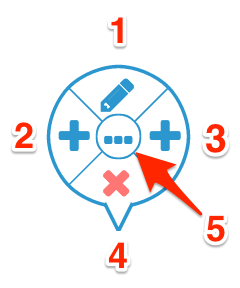

# Command Wheel
Command wheel pops up next to the selected element.

</img>

1. *Edit* opens in-line editor for the selected element or value.
2. *Add before* adds new element or value before the selected one.
3. *Add after* adds new element or value after the selected one.
4. *Delete* deletes selected element or value.
5. `...` in the center opens context menu.

# Context Menu

Context menu opens when you right-click on the model element with the mouse or click on the `...` button in the command wheel.

</img>

1. *Cut* removes selected model elements and copies them to the clipboard.
2. *Copy* copies selected model elements to the clipboard.
3. *Paste* inserts elements copied to the clipboard into the model after selected element.
4. *Add* inserts new model element after the selected one.
5. *Delete* deletes selected elements from the model.
6. *Edit* switches selected model element into editing mode.
7. *Toggle Comment* comments out selected model elements or removes commenting. You can also press **Ctrl**+**/** (**&#8984;**+**/**) on the keyboard.
