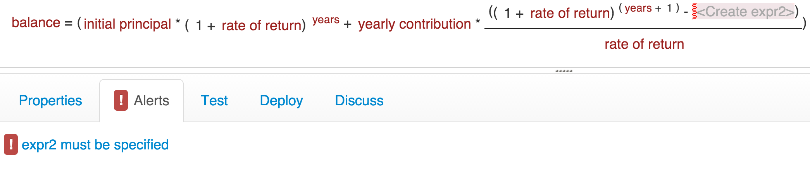
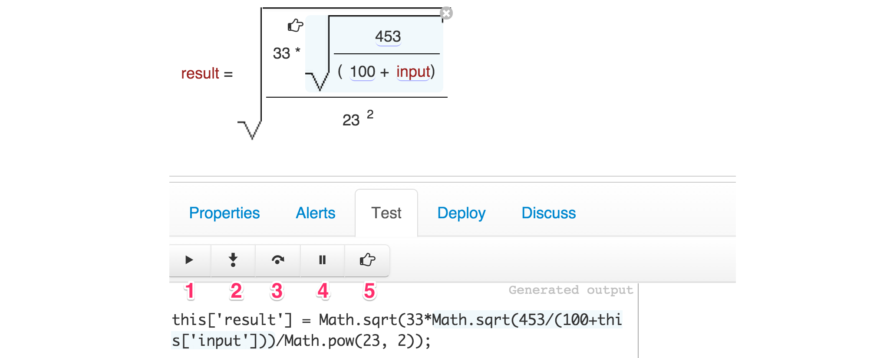
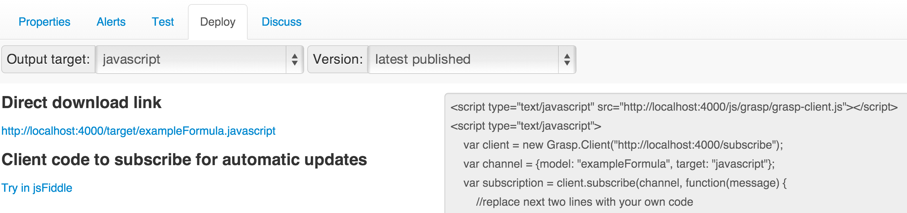

## Alerts Panel

**Alerts** tab contains model validation errors, if any.

If there are any alerts, you will see a red exclamation sign on the tab.
If you click on any alert, the main editor will automatically scroll to the element that is responsible for it.

## Test Panel

**Test** tab is where you can generate and preview model output, possibly using step-by-step debugger to understand exactly how this output was produced from model's elements and attributes.

This panel has 3 sections:

* Left section contains generated model output.
* Center section may contain a form to see input and output data for the model.
* Right section contains console output of the generator.

This panel also has its own toolbar for debugging commands:

1.	*Run* - regenerate model output. Note: output is automatically regenerated each time when you make edits to the model.
2.	*Step into* - take a single step through the model, visiting all subelements on the way.
3.	*Step over* - go through all subelements in the currently selected element and return back to the same level.
4.	*Stop* - interrupt generation or execution.
5.	*Add/remove breakpoint* - add breakpoint to the selected model element, so that when generation process runs, it will stop at this element and you can see exactly how its output is being generated. You can remove breakpoint by clicking on the same button one more time.

On the right-hand side of the toolbar there is also a dropdown, in which you can pick an output target that you want to test - for example, if there are output formats to produce code from your model in different programming languages.

Once the model output is produced, you can easily see which part of it was generated from a specific model element, or vice versa, see which element is responsible for a specific part of the output. Just click on an element or on the output text and both the text and the model element will become highlighted and scrolled into focus.

## Deploy Panel

**Deploy** tab contains information that you may need to integrate generated output from this model into your other systems.


Here you can select the output target that your application needs, as well as version of the model:

* *Latest published* - latest version in master repository.
* *Specific version number* - if you know which version exactly you are looking for.
* *Work in progress* - if you have private changes made in your workbench, you can get version for integration testing too.

The main panel contains download link for generated target file, as well as some code examples that show how you can create a client that automatically subscribes for generated output and future updates, if applicable.

## Discuss Panel

**Discuss** tab contains model discussion area in which you can add comments such as issues or other information that you want to discuss with other users of this model.

Each model has its own discussion topic in Grasp.

