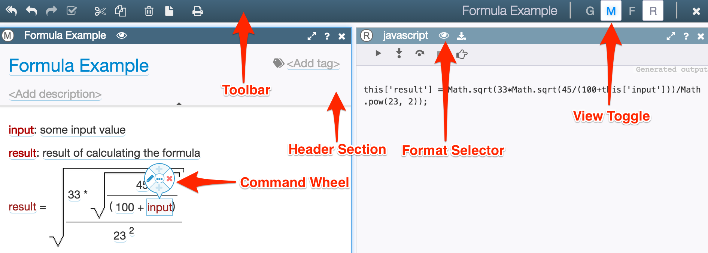

# Editor

The editor opens when you click on a model in the explorer tree.

It contains toolbar, main editing area and a set of panel tabs to control model settings and perform other operations on it.

The editor flavor currently used by Grasp is called *structured*, or *projectional*, editor. Other types will be added in the future - e.g. diagram editor, a regular form, or a code editor with content assist and autocomplete feature.

What you see in the main editing area will depend on the editor type and the format that you choose from available options. There is always a default format, but you can select a different option if it is available from the **Switch View** submenu in the model's menu.

When needed, you can quickly maximize editing area by double-clicking on its toolbar.

In Grasp you can have multiple undo/redo levels and they get persisted in your workbench until you publish model changes into the master repository. So if you made some changes and closed the workbench, next time you open it both your changes and your undo history will still be there.

Model changes are saved in the workbench automatically.

Deletion of the model is not permanent until it is published to the main repository. The model is simply marked as deleted in your workbench (unless it's a brand new model that has not yet been published into the repository). If you want to restore the model, simply click on the *revert* button to go back to the original version of it. However, once you publish the deletion change, you won't be able to restore it anymore.

