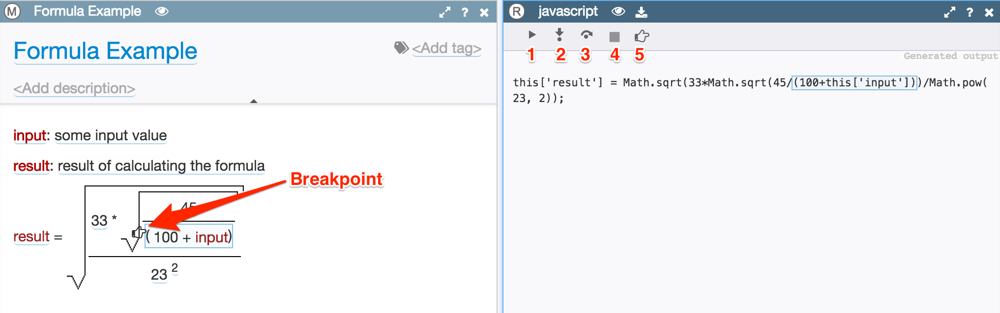

# Result Viewer

When viewing a document in the **M** (model) view you can see the result of applying an output format (generator) in the **R** (result) view.

The result view has a special toolbar for debugging code generation.

1.	*Run* - regenerate model output. Note: the output is automatically regenerated each time when you make edits to the model.
2.	*Step into* - take a single step through the model, visiting all subelements on the way.
3.	*Step over* - go through all subelements in the currently selected element and return back to the same level.
4.	*Stop* - interrupt generation.
5.	*Set breakpoint* - Add breakpoint. First you need to select an element in the model and then click on this button. When generation process runs, it will stop at this element and you can see exactly how its output is being generated. Two remove a breakpoint select an element and click on this button again.

Once the result is produced, you can easily see which part of it was generated from a specific model element, or vice versa, see which element is responsible for a specific part of the output. Just click on an element or result and both the text and the model element will become highlighted and scrolled into focus.
