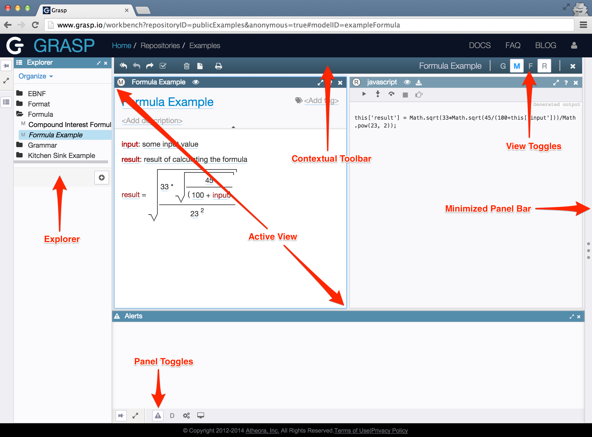

# Workbench Organization

Workbench consists of the explorer and the editor:

You can drag the divider between workbench sections to resize them. You can also double-click on the divider to minimize/restore one of the sections.

## Explorer

Workbench explorer is a panel in which you can see a tree with a list of documents (i.e. models) in your repository, create models or open them for editing.

The explorer tree can organize your models in several ways, accessible via *Organize* menu at the top right corner of the panel:

* *Group by grammars* - show all models created from the same grammar in one folder, using grammar's name as a folder name.
* *Group by tags* - create a subfolder for each model tag (see next chapter). So, for example, if model has tags `foo`, `bar`, `baz`, then the explorer tree will create a chain of folders `foo/bar/baz` and place your model into it. This view option is convenient when you want to group different models by some common principle, e.g. by a business function that they together implement.

Each model name that you see in the explorer tree has some formatting applied so that you can easily check its type or status.

To the left of the model name you can see an icon that depicts its type:

* **G** - for grammars
* **F** - for formats
* **M** - for all other model types

If you have made changes to the model, so that workbench now contains a private copy of it, the model name will be shown in _italics_. After you publish your changes back to the master repository, the name styling will change to regular font.

Immediately after making some model edits you may notice that an asterisk `*` is briefly added to the model name to indicate that this model is being saved on the server. Once this is done, the asterisk will disappear. Sometimes there may be server communication problems and the asterisk will stay for longer.

## Model Editor

Next to the workbench explorer is usually a model editor, showing one of the models in your repository or the configuration model of the repository itself.

The editor is described in the next chapter.

---

Model name that is shown in italics indicates:
- [x] Unpublished changes
- [ ] Unsaved changes

> Italics indicate that the model changes were saved to your workspace but are not published to the master repository yet.

---
